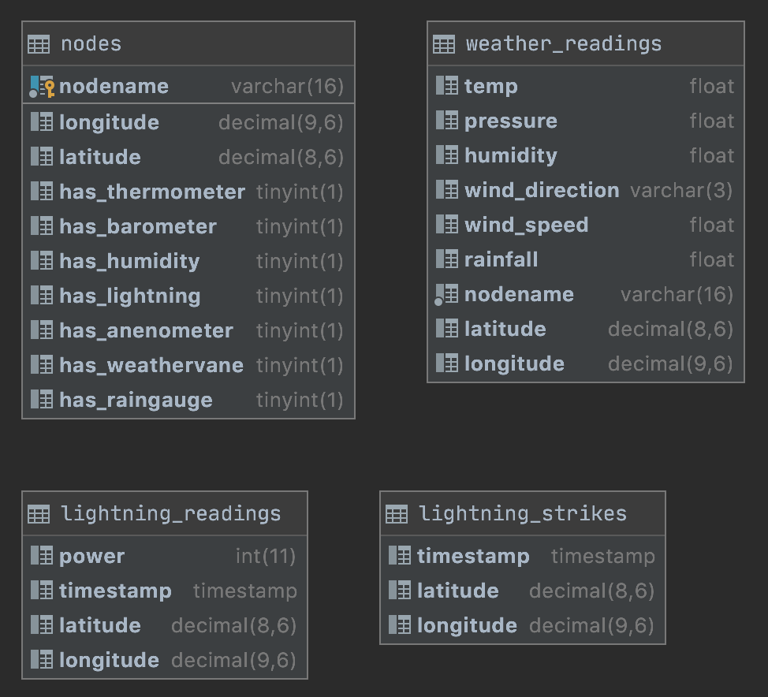

This project was built in VS Code's PlatformIO extension. See intro video [here](https://www.youtube.com/watch?v=dany7ae_0ks). The step where you download the Arduino IDE doesn't seem to be neccessary on MacOS.

## Cloning

    git clone https://github.com/nightduck/stormWatch.git
    cd stormWatch
    git update-index --assume-unchanged data/config.json

The last line prevents you from accidentally publishing your config, and all the private keys associated with it, to the git tree.

## Data Directory

The data directory contains settings and private keys that should not be source controlled. A sample config.json is provided,
but you will have to add your own AWS keys and certs for it to work. You can specify the filenames of these keys and certs
in the config.json file.

## Db Design

An Amazon EC2 instance hosts a flash server, which acts as our web interface. It also subscribes to the AWS IoT services with the
Flask-MQTT extension. Upon receiving either weather or lightning data, it'll trigger callbacks in the Flask server, which will record
those readings in the weather_readings and lightning_readings tables, respectively. It will perform processing on similarly timed lightning
to triangulate the location of the strike. The result of this calculation is stored in the lightning_strikes table. There is another
table that stores information on individual nodes. The design of each database is below. A script to generate them is at [db_design/db_creation.sql](db_design/db_creation.sql)

